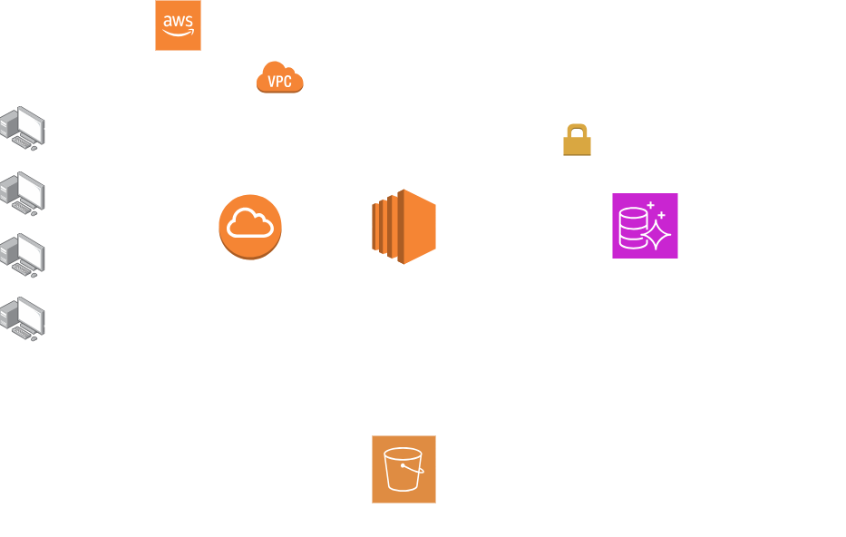

## Events API

Spring Boot backend example.

### Endpoints

* POST - /api/events
    - Create events

* GET - /api/events?page=0&size=20
    - Get events

* GET - /api/events/filter?page=0&size=20
    - Filter events

* GET - /api/events/{EventId}
    - Get event detail

* POST - /api/coupons/event/
    - Create coupon

### System Architecture Diagram

